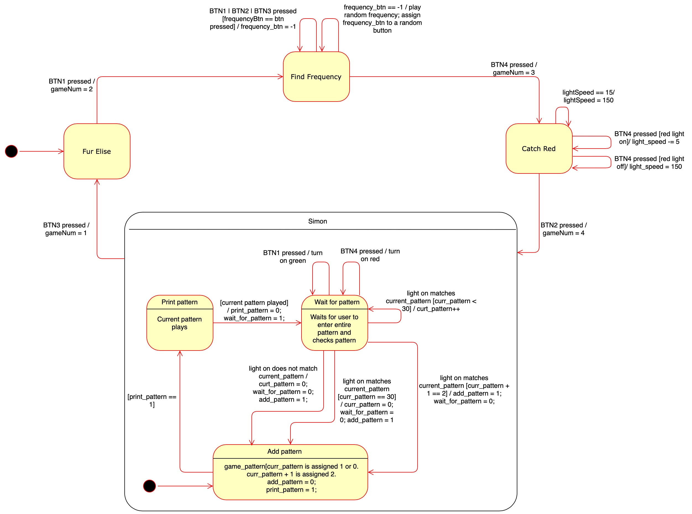

# Lab 2: Blinky-Buzzy-Toy

## Location
The main file for the program is found in blinky_buzzy_toy.c in the current
directory. The project is further subdivided into three directories:
1. games - source and header files for the four games that represent the four
states.
2. game_utils - source and header files for the buzzer, buttons, and led.
3. states_and_interrupts - source and header files for the state transitions
and interrupt handlers. Also includes the .s file for the state transitions
and interrupt handling for games/states two and three.

## Button Mapping

In the instructions listed below, it is important to note that BTN1, BTN2,
BTN3, and BTN4 correspond to the S1, S2, S3, and S4 buttons on the msp430 accordingly.

## Instructions
To run the game, please follow the instructions lisited below:
1. In the current directory (project) type 'make'to build and install all the
libraries and compile object files. The timerLib will consequently be made.
2. In the current directory (project) type 'make load' to load and run the
program on the msp430.
2. The first state, representing the first game, is a musical arragement and
it includes lights that change their dimness. To
continue to the next state, press BTN1.
3. The second state, representing the second game, is find the button that
changes the pitch. Essentially, either BTN1, BTN2, or BTN3 are mapped to
random pitch. When you select the correct button, the pitch will change. Look
at the lights to also tell when the correct button is pressed (green light
will turn on) or the incorrect button is pressed (red light will turn on). To
move to the next state, press BTN4.
4. The third state, representing the third game, is called catch red. The
objective is to press BTN4 every time the red light blinks. If you continue to
hit the button at this time, the lights will incrementally get faster. If you
incorrectly hit BTN4 when the red light is not shining, the game will
restart. To move to the next state press BTN2.
5. The fourth state, representing the fourth game is simon. The game in total
has 32 random moves that build up successively. First, the game will blink a
light and wait for you to press a button. If the light was green then press
BTN1. If the light was red, then press BTN4. If you successfully entered the
correct pattern, the pattern will be re-modeled by shining the led pattern and
a new pattern will be added. After the pattern is done being displayed, press
the new pattern (BTN1 for green, BTN2 for red). If you incorrectly enter the
wrong pattern, the game will start from the beginning again. To go back to
state 1, press BTN3.

NOTE: type 'make clean' to remove all *.o, *.elf files, lib, and h.

## State Transition Diagram

## Project Description

### State 1 - Game 1 - Fur Elise
The first state/game is a musical arrangement. This game continues to loop
through a character array with numbers that encode the specific frequency that
is used to make the sound. While the notes are playing, the lights are also
shining in a pattern. A green light will be turned on and then the red light
will be turned on, but dimmed. Then when the song re-loops, the red light will
turn on, and the green light will be turned on, but dimmed. In order to dim
the light, I have the light turn turn on and off several times.

To exit, press BTN1.

### State 2 - Game 2 - Find the Frequency
The objective of this game is to find the button that is mapped to the current
pitch playing.  This game has randomized pitches (calculated based on the
clock ticks), and randomly selects a button (either BTN1, BTN2, or BTN3) that corresponds to the pitch.
Thus, if the button that maps to the pitch is selected, then a new pitch will
be played. Again, the user has to find which button matches to this new
pitch. Once it is found, a new pitch will be played and the cycle will
continue.

To exit, press BTN4.

### State 3 - Game 3 - Catch Red
This game consists of alternating red and green lights that turn on and
off. The objective of this game is to press BTN4 while the red light is
shining. If BTN4 is pressed while the red light is on, then the speed of the
alternating lights will get faster. This sequence will continue until the
threshold of the light_speed reaches 15, or when the user incorrectly presses
BTN4 while the red light is not on.

To exit, press BTN2.

### State 4 - Game 4 - Simon
This game is the msp430 representation of the well-known game Simon. The
objective of the game is to correctly enter the pattern of red and green
lights that the system procures as it repeatedly adds a new stage to the
pre-existing pattern. When the game first starts off, a red or green light
will shine. Please wait for the entire pattern to finish displaying and then
enter the pattern. If you correctly entered the pattern, then a new pattern
will be added and the cycle will continue. Press BTN1 for the green light and
BTN4 for the red light

For example, the following is a probable run of Simon:
1. System shows green light
2. green light turns off.
3. user presses BTN1
4. System shows green light, pauses, and then shows red light
5. red light turns off
6. user presses BTN1 and the presses BTN4

This will continue only the max 32 random patterns occur or the user
incorrectly enters a pattern.

In the event that a incorrect pattern is entered,
the game will restart with a single pattern being displayed.

To exit, press BTN3.

### Tips

It is also important to note that the msp430 is very sensitive, so accidental
double button clicks will cause the game to re-start, without you, maybe
realizing it. I found the best way to avoid this is to lay the msp430 flat on
the table and press down. I have also found that holding the button rather
than quickly pressing it helps. Above all, just make sure that you aren't
accidentally pressing the button twice, since mine has proven to be extremely sensitive.
